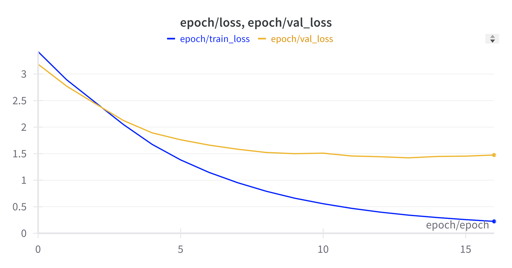

# Machine-Translation-Seq2Seq-with-LSTMs-for-Arabic-Dialects-to-Standard-Arabic

# Content
- [Introduction](#introduction)
- [Data](#data)
- [Training](#training)
- [Predictions](#predictions)
- [Results](#results)

# Introduction
This repo is about Translate Arabic Dialect To Modern Standard Arabic dataset is based on 6 countries' Dialect languages

# Data
You can find data in [Kaggle](https://www.kaggle.com/datasets/kilwazoldik/translate-arabic-dialect-to-modern-standard-arabic) 

| Data | Num of lines |
| ---- | ------------ |
| Train | 125737 |
| Validation | 7218 |
| Test | 7234 |

# Training
## Steps

1. We clean Data by removing duplicates and nulls from train dataframe
2. Remove punctuations from data
3. Train Tokenizer on train data
4. Encode train data using tokenizer for more information check [utils.py](scripts/utils.py)
5. Init Seq2Seq model based on lstm using [script](scripts/models.py)
6. Train model using train.py [train.py](scripts/train.py) we use early stopping for non updated best checkpoint after 3 epochs

as we can see model stopped training at epoch 16

# Predictions
We use [predict.py](scripts/predict.py) to predict test data

# Results
we evaluate test datset using [evaluate.py](scripts/evaluate.py) to get BLEU score

Corpus BLEU score: 0.3642
